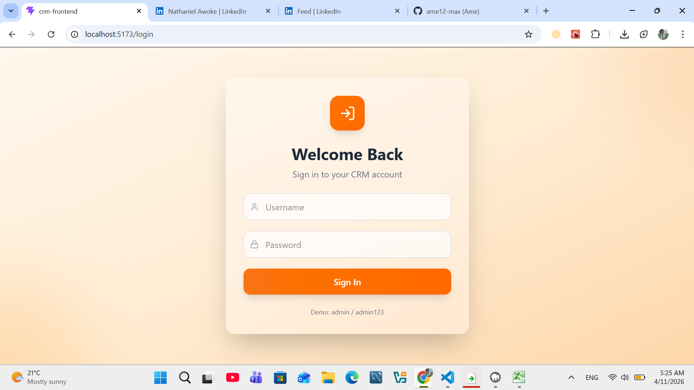
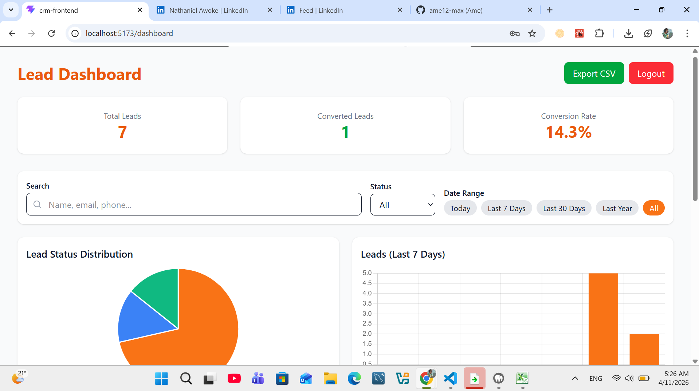
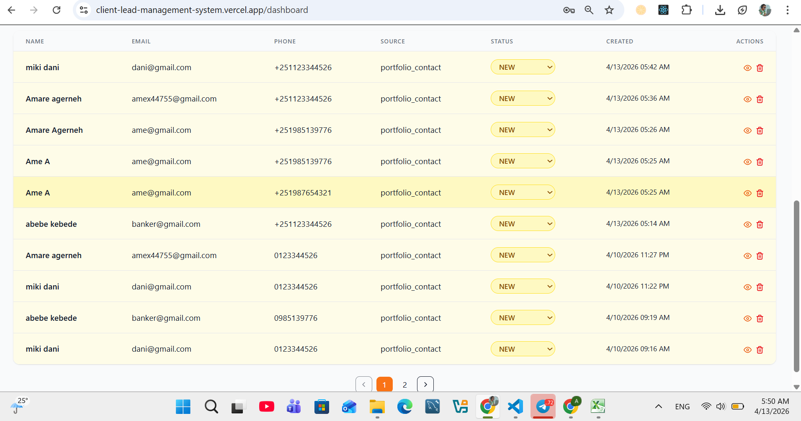
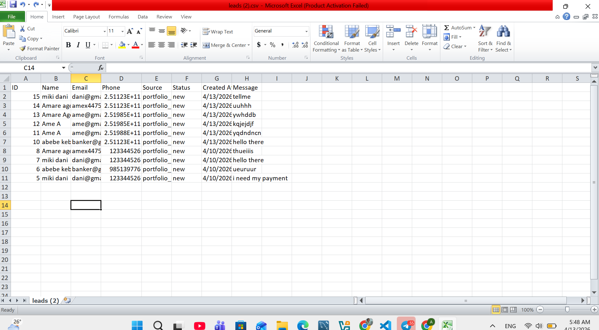
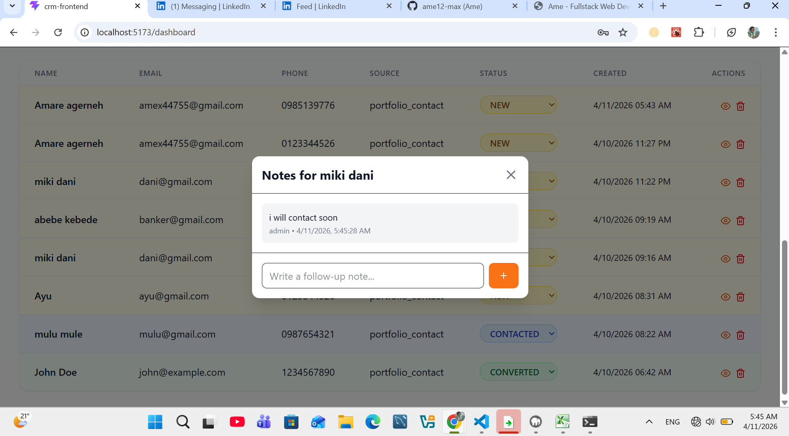

# 📋 Client Lead Management System (Mini CRM)

A full‑stack **Client Lead Management System** built for the Future Interns Full Stack Web Development internship (Task 2). It allows business owners to capture, track, and manage leads from website contact forms – with status updates, follow‑up notes, analytics, and email notifications.

🔗 **Live Demo:** [https://client-lead-management-system.vercel.app/](https://client-lead-management-system.vercel.app/)  
📁 **GitHub Repository:** [https://github.com/ame12-max/FUTURE_FS_02](https://github.com/ame12-max/FUTURE_FS_02)

---

## 📸 Screenshots

| Login Page | Dashboard – Analytics & Charts |
|------------|-------------------------------|
|  |  |

| Lead Table with Status & Notes | Export CSV |
|-------------------------------|------------|
|  |  |

| Notes Modal |
|-------------|
|  |

*(Place your actual screenshots inside the `screenshots/` folder with these filenames)*

---

## ✨ Features

- ✅ **Secure Admin Authentication** – JWT‑based login  
- ✅ **Lead Management** – View, filter, search, and delete leads  
- ✅ **Status Updates** – Change status (New → Contacted → Converted) inline  
- ✅ **Follow‑up Notes** – Add and view notes per lead  
- ✅ **Real‑time Polling** – Dashboard auto‑refreshes every 5 seconds; toast notification for new leads  
- ✅ **Analytics Dashboard** – Total leads, converted leads, conversion rate + charts (status distribution & daily trends)  
- ✅ **Pagination** – 10 leads per page with page navigation  
- ✅ **Export to CSV** – Download current filtered leads  
- ✅ **Email Notifications** – Sends a styled HTML email to the admin when a new lead arrives (via Resend API)  
- ✅ **Integration with Portfolio** – Contact form from Task 1 automatically creates leads in this CRM  
- ✅ **Responsive Design** – Works on mobile, tablet, and desktop  
- ✅ **Dark Mode Ready** – Uses Tailwind dark variant  

---

## 🛠️ Tech Stack

### Backend
- **Node.js** + **Express.js** – REST API  
- **MySQL** (with `mysql2`) – Database  
- **JWT** – Authentication  
- **bcryptjs** – Password hashing  
- **Resend** – Email notifications (HTTP API)  
- **dotenv** – Environment variables  

### Frontend
- **React 18** + **Vite**  
- **Tailwind CSS** (v4) – Styling  
- **Framer Motion** – Animations  
- **Chart.js** + **react-chartjs-2** – Analytics charts  
- **Axios** – API calls  
- **React Hot Toast** – Notifications  
- **React Router DOM** – Routing  

---

## 📁 Folder Structure
FUTURE_FS_02/
├── crm-backend/ # Backend
│ ├── config/ # Database connection
│ ├── controllers/ # Auth, Lead, Note controllers
│ ├── middleware/ # JWT auth middleware
│ ├── models/ # Lead, Note, User models
│ ├── routes/ # API routes
│ ├── utils/ # Email service (Resend)
│ ├── .env
│ └── server.js
├── crm-frontend/ # Frontend (React + Vite)
│ ├── public/
│ ├── src/
│ │ ├── assets/
│ │ ├── components/
│ │ │ ├── Charts/
│ │ │ ├── common/
│ │ │ ├── Layout/
│ │ │ └── Leads/
│ │ ├── context/ # Auth context
│ │ ├── pages/ # Login, Dashboard
│ │ ├── services/ # API client
│ │ ├── App.jsx
│ │ ├── main.jsx
│ │ └── index.css
│ ├── .env
│ └── package.json
└── README.md

text

---

## 🔧 Installation & Setup

### Prerequisites
- Node.js (v18+)
- MySQL (v8+)
- npm or yarn
- Git
- Resend API key (free)

### 1. Clone the repository

```bash
git clone https://github.com/ame12-max/FUTURE_FS_02.git
cd FUTURE_FS_02
2. Backend Setup
bash
cd crm-backend
npm install
Create a .env file in crm-backend/:

env
PORT=5000
DB_HOST=localhost
DB_USER=root
DB_PASSWORD=your_mysql_password
DB_NAME=crm_db
JWT_SECRET=your_super_secret_key
RESEND_API_KEY=re_xxxxxxxxxxxxx
EMAIL_FROM=onboarding@resend.dev
ADMIN_EMAIL=your-email@example.com
CRM_FRONTEND_URL=http://localhost:5173
Important: Get a free Resend API key from resend.com. Use onboarding@resend.dev as the sender for testing (emails only go to your own address). For production, verify a domain.

3. Database Setup
Run MySQL and execute the following SQL:

sql
CREATE DATABASE crm_db;
USE crm_db;

-- Users table (admin)
CREATE TABLE users (
  id INT AUTO_INCREMENT PRIMARY KEY,
  username VARCHAR(100) UNIQUE NOT NULL,
  password VARCHAR(255) NOT NULL,
  created_at TIMESTAMP DEFAULT CURRENT_TIMESTAMP
);

-- Leads table
CREATE TABLE leads (
  id INT AUTO_INCREMENT PRIMARY KEY,
  name VARCHAR(255) NOT NULL,
  email VARCHAR(255) NOT NULL,
  phone VARCHAR(50),
  source VARCHAR(100) DEFAULT 'website',
  status ENUM('new','contacted','converted') DEFAULT 'new',
  message TEXT,
  created_at TIMESTAMP DEFAULT CURRENT_TIMESTAMP,
  updated_at TIMESTAMP DEFAULT CURRENT_TIMESTAMP ON UPDATE CURRENT_TIMESTAMP
);

-- Notes table
CREATE TABLE notes (
  id INT AUTO_INCREMENT PRIMARY KEY,
  lead_id INT NOT NULL,
  note TEXT NOT NULL,
  created_by VARCHAR(100),
  created_at TIMESTAMP DEFAULT CURRENT_TIMESTAMP,
  FOREIGN KEY (lead_id) REFERENCES leads(id) ON DELETE CASCADE
);

-- Insert default admin (password: admin123)
-- Generate hash using: node -e "const bcrypt = require('bcryptjs'); console.log(bcrypt.hashSync('admin123', 10));"
INSERT INTO users (username, password) VALUES ('admin', '$2b$10$YourHashedPassword');
4. Frontend Setup
From the project root:

bash
cd crm-frontend
npm install
Create a .env file in crm-frontend/:

env
VITE_API_BASE_URL=http://localhost:5000
5. Run the Application
Backend (in crm-backend/):

bash
node server.js
# or with nodemon: npm run dev
Frontend (in crm-frontend/):

bash
npm run dev
Open http://localhost:5173 – you will be redirected to the login page.

6. Admin Login
URL: http://localhost:5173/login (or /dashboard redirects to login)

Username: admin

Password: admin123

🔗 Integration with Portfolio (Task 1)
Your existing portfolio contact form can send leads directly to this CRM.
In your portfolio backend .env, set:

env
CRM_API_URL=https://future-fs-02-5nif.onrender.com
The portfolio’s contactController already includes the API call to /api/leads. When someone fills out the contact form, a new lead is automatically created in the CRM.

📡 API Endpoints (Selected)
Method	Endpoint	Description	Auth
POST	/api/auth/login	Admin login	Public
GET	/api/leads	Get paginated, filtered leads	JWT
GET	/api/leads/analytics	Get total & converted counts	JWT
POST	/api/leads	Create a new lead (public)	Public
PUT	/api/leads/:id/status	Update lead status	JWT
DELETE	/api/leads/:id	Delete a lead	JWT
GET	/api/notes/lead/:leadId	Get notes for a lead	JWT
POST	/api/notes/lead/:leadId	Add a note	JWT
🚀 Deployment
Backend (Render / Railway)
Set all environment variables on your hosting platform.

Use a cloud MySQL database (Aiven, ClearDB, PlanetScale).

Update CRM_FRONTEND_URL to your live frontend URL.

Live Backend: https://future-fs-02-5nif.onrender.com

Frontend (Vercel / Netlify)
Build: npm run build

Deploy the dist folder.

Set VITE_API_BASE_URL to your live backend URL.

Live Frontend: https://client-lead-management-system.vercel.app/

👨‍💻 Author
Amare – GitHub | LinkedIn

🙏 Acknowledgements
Future Interns – Internship program

React, Tailwind CSS, Framer Motion

Resend – Email delivery

Chart.js – Analytics charts

📄 License
This project is for educational purposes as part of the Future Interns Full Stack Web Development internship.